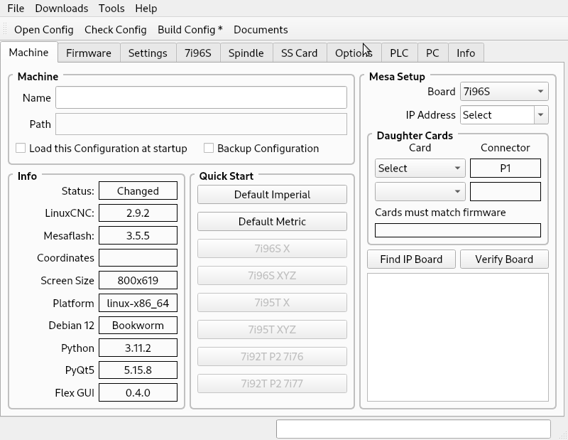
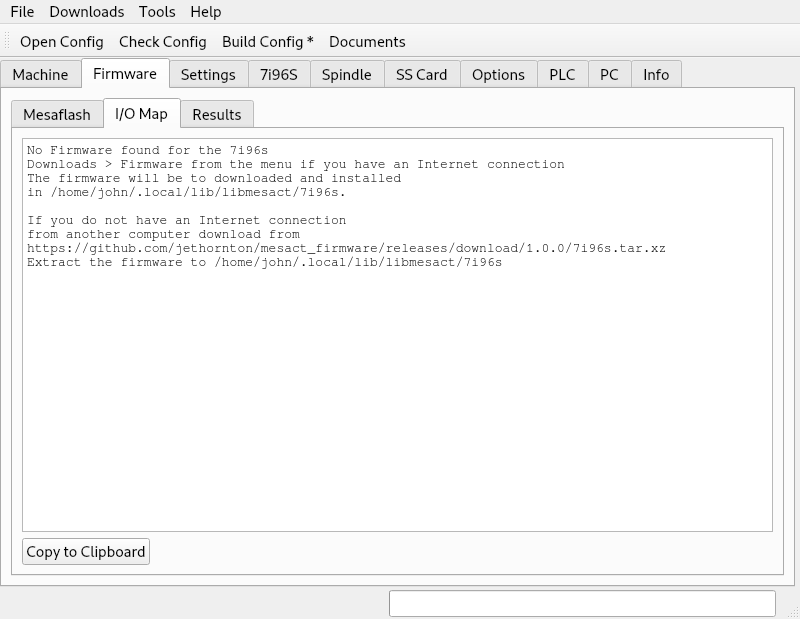
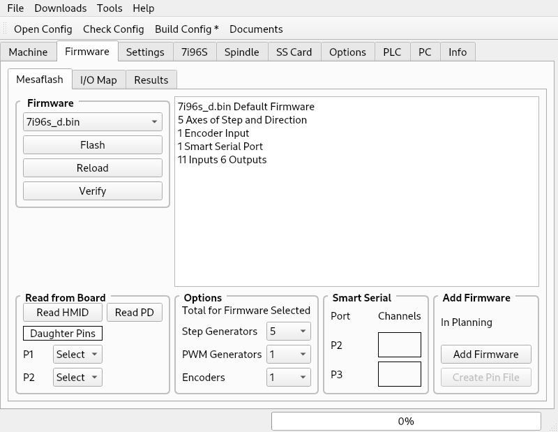
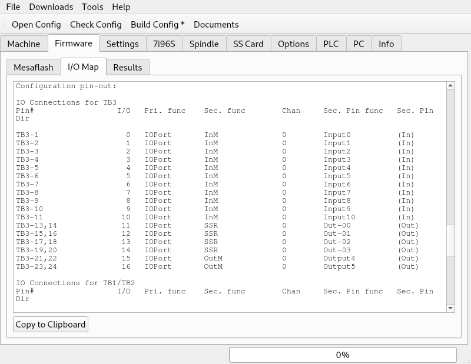
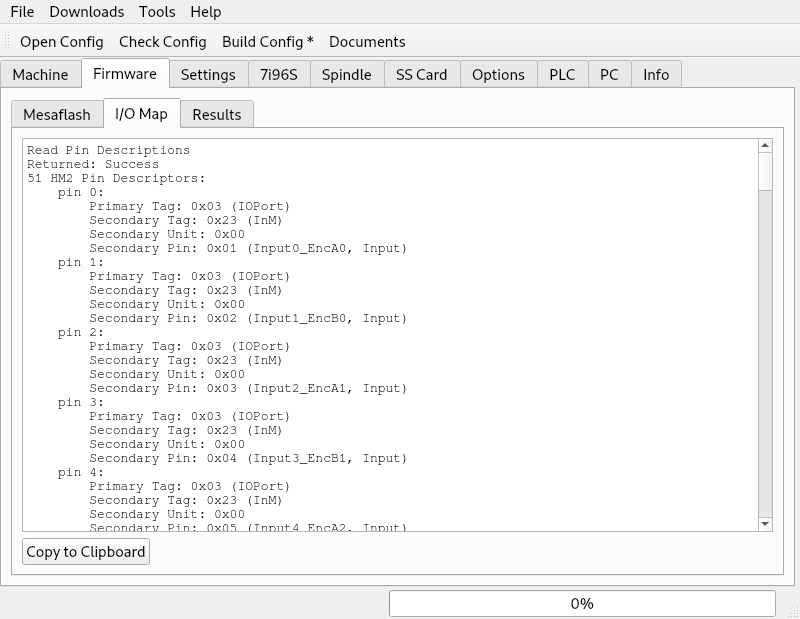

Firmware
========

Flashing firmware to a Mesa board is done by first selecting a board from the
Machine tab in the Mesa Setup group box.

If you have not downloaded the firmware for that board instructions are shown on
the I/O Map tab

If you have internet connected to the PC select Downloads > Firmware after
selecting a Mesa board in the Mesa Setup group box.

Now you can select the firmware you want to flash into the Mesa board from the
Mesaflash tab.

You can now Verify that the selected firmware is already flashed to the board or
Flash then Reload then Verify the firmware.

After selecting a firmware you can view the I/O Map of that firmware.

The Read HMID will read the I/O map from the board if it is conneced.

The Read PD will display the I/O map in a pin description style.

The Options, Smart Serial and Add Firmware are for future use and not used now.

